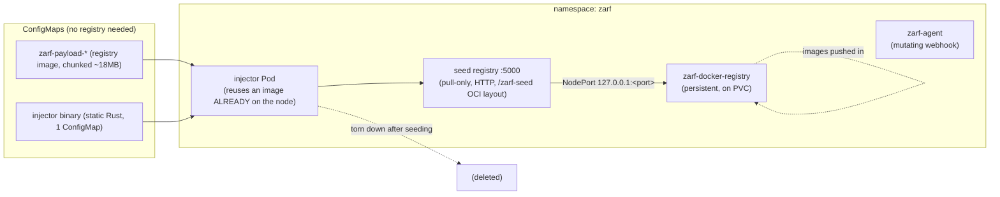

# Zarf init — how the air-gap registry bootstraps

This document traces what `zarf init` does when it stands up the in-cluster registry on a
DataEngine K8s cluster, and **why** each step exists. It complements
`documentation/steps.md` (Stage A2 — "scp + ssh, zarf init / deploy") and exists mainly so
the next air-gap bring-up can debug the injector/registry phase quickly.

The whole point of `zarf init` is to break one chicken-and-egg problem: **to run a registry
in the cluster, Kubernetes must pull the registry's own image — from a registry that doesn't
exist yet.** Zarf breaks the loop using only vanilla Kubernetes objects (Pods + ConfigMaps),
so it works on any conformant cluster with no CRI access, no `kubectl cp`, and no node SSH.

---

## The constraint that shapes everything

The obvious fix — "put the registry image in a ConfigMap" — fails: **etcd caps objects at
~1 MB**, and base64-encoding leaves only ~670 KB usable per ConfigMap. The seed registry
image is ~18 MB. That single limit is the entire reason the injector exists.

---

## Component map — what Zarf plants



---

## Stage-by-stage

### Stage 0 — Prereqs (must be true BEFORE `zarf init`)
- A **working CNI / pod network** — this is the load-bearing prerequisite (see Failure modes).
- Nodes `Ready`, kube-proxy running, `route_localnet=1` (kube-proxy sets this).
- A default **StorageClass** that can bind the registry's PVC (on VAST clusters this is the
  VAST CSI driver — the registry PVC mounts an NFS export; DNS for the VIP-pool FQDN must
  resolve, see the CSI notes).

### Stage 1 — Inject the payload (pure API writes, no network dependency)
1. Zarf splits the seed registry image tarball into many `zarf-payload-*` **ConfigMaps**.
2. Zarf writes one more ConfigMap holding a tiny **statically-compiled Rust binary** (the
   injector). ConfigMaps are just API objects — no registry required to create them.

### Stage 2 — Start the injector (the chicken-and-egg break)
3. Zarf finds an image **already present** in the cluster's runtime cache and uses it as the
   **injector Pod's** image, overriding its command to run the injector binary from the
   mounted ConfigMap. The injector pod therefore starts **without pulling anything**.
4. The injector binary concatenates the `zarf-payload-*` chunks back into `payload.tar.gz`,
   **verifies the SHA256** against an arg passed to it, extracts to `/zarf-seed` (OCI layout),
   and serves a **pull-only, insecure, HTTP OCI registry on port 5000** — the **seed registry**.

### Stage 3 — Expose the seed on localhost NodePort
5. The seed Service is published as **`127.0.0.1:<nodeport>`**. Using `127.0.0.1` means every
   node's kubelet pulls from its **own localhost** — no DNS, no routable registry IP needed
   mid-bootstrap. (Relies on `route_localnet=1`.)

### Stage 4 — Deploy the real registry FROM the seed  ← common failure point
6. Zarf deploys the persistent **`zarf-docker-registry`** Helm chart with its image set to
   **`127.0.0.1:<nodeport>/library/registry:3.0.0`**. Kubelet pulls that image *from the seed*
   → the real registry starts on its **PVC**.
   - This is the **only** step where a node must reach a *pod* (the injector) over the cluster
     network: `127.0.0.1:<nodeport>` → kube-proxy DNAT → injector pod IP. Everything else is
     ConfigMap/API writes. So a broken pod network surfaces **right here** first.

### Stage 5 — Seed the real registry, tear down the injector
7. Once `zarf-docker-registry` is `Running`, Zarf pushes all init-package images into it, then
   **deletes the injector pod + `zarf-payload-*` ConfigMaps**. They existed only to bootstrap.

### Stage 6 — Deploy zarf-agent
8. A **mutating admission webhook** that rewrites image references in every pod spec to point
   at the internal Zarf registry, so workloads transparently pull from the air-gap registry
   afterward.

---

## Failure modes — what shows up where

| Symptom | Stage | Likely cause | Where to look |
|---|---|---|---|
| registry pod: `Failed to pull … 127.0.0.1:<port>/library/registry:3.0.0: connection refused` **on OpenShift** | 4 | **OVN-Kubernetes ignores `hostPort` bound to `127.0.0.1`** — the default Zarf path can't be reached. See [OpenShift / OVN-Kubernetes](#openshift--ovn-kubernetes) below | `oc get network.operator cluster -o jsonpath='{.spec.defaultNetwork.type}'` → `OVNKubernetes`? Fix = registry proxy mode |
| registry pod: `Failed to pull … 127.0.0.1:<port>/library/registry:3.0.0: connection refused` (vanilla k8s) | 4 | injector pod unreachable over pod network (broken/missing CNI, or injector on another node with broken cross-node routing) | `kubectl get pods -n zarf -o wide` (injector Running? which node?); `kubectl get endpoints -n zarf`; compare injector vs registry node |
| registry pod stuck `ContainerCreating`, `no CNI plugin`, node `NotReady` | 0/2 | **no** network plugin installed at all (fails earlier than a pull) | `kubectl get nodes`; `kubectl get pods -n kube-system \| grep -iE 'flannel\|calico\|cilium'` |
| registry pod `FailedMount` / NFS `Name or service not known` | 0/4 | VAST VIP-pool FQDN not resolvable — DNS delegation / VIP-pool DNS domain missing in VMS | `nslookup <vip_pool_fqdn>` on the node; see CSI DNS notes |
| pull refused only on some nodes, `127.0.0.1:<port>` | 3/4 | `route_localnet=0` on that node → localhost→NodePort refused | `sysctl net.ipv4.conf.all.route_localnet` (kube-proxy should set =1) |
| injector pod missing, registry never seeds | 5 | `zarf init` interrupted before seeding; re-run **after** the network is healthy | `kubectl get pods -n zarf` |
| stale error references an OLD `<nodeport>` while live registry NodePort differs | 4 | transient bootstrap race that already resolved (injector torn down, real registry up) | confirm current `kubectl get svc,pods -n zarf` — likely healthy |

**Rule of thumb:** Stage 4 is the *only* network-dependent step in an otherwise network-free
bootstrap. If `zarf init` breaks at the registry image pull, **fix/verify the cluster network
first, then re-run `zarf init`** — do not reinstall Zarf blindly.

---

## OpenShift / OVN-Kubernetes

**The default `zarf init` does not work on OpenShift.** This is the single most likely reason
you'll see the Stage 4 `connection refused … 127.0.0.1:<port>` error on a customer cluster.

### Why it breaks
OpenShift's default CNI is **OVN-Kubernetes**, which **does not honor `hostPort` bound to
`hostIP: 127.0.0.1`**. Zarf's default registry-access path (Stages 3–4) reaches the seed
registry and, afterward, the real registry at **`127.0.0.1:<port>`**. On OVN that localhost
bind resolves to nothing, so the CRI's pull is refused. Note this is **not** a broken CNI —
OVN is working correctly; it simply doesn't implement the `127.0.0.1` hostPort trick that
kube-proxy/flannel do. So all the "vanilla" diagnostics (injector Running, endpoints present,
`route_localnet`) can look **healthy** and the pull still fails.

### The fix — registry **proxy mode** with host networking
In proxy mode Zarf replaces the `127.0.0.1` hostPort with a **`socat` proxy DaemonSet using
`hostNetwork: true`** (host network *is* honored by OVN), plus a long-lived injector DaemonSet.

1. **Apply the OpenShift SCC prereqs first.** `hostNetwork: true` is blocked by OpenShift SCC
   admission unless the pods' service account is bound to an SCC that allows it. Zarf ships a
   prereqs manifest for this:
   ```bash
   oc apply -f resources/openshift/zarf-init-prereqs.yaml     # SCC + SA bindings
   ```
2. **Init in proxy mode with host-network proxy:**
   ```bash
   zarf init --registry-mode=proxy -a amd64 --set HOST_NETWORK_PROXY=true
   ```
   (Some Zarf versions gate this behind `--features=registry-proxy=true`. IPv6-only clusters
   flip to host network automatically.)

### Before re-running
- **Confirm OVN:** `oc get network.operator cluster -o jsonpath='{.spec.defaultNetwork.type}'`
  → expect `OVNKubernetes`.
- **Flag syntax varies by Zarf version** — registry proxy mode is a newer feature. Check
  `zarf version` and `zarf init --help` for the exact flags (`--registry-mode`, `--features`,
  `HOST_NETWORK_PROXY`) before running; the mechanism is stable, the CLI surface has shifted.
- **Registry PVC:** OpenShift assigns a per-namespace UID range + MCS labels and relabels the
  PVC to match — handled automatically, but the SCC must permit `hostNetwork` for the
  proxy/injector pods.

---

## Sources

- [The 'init' Package — Zarf docs](https://docs.zarf.dev/ref/init-package/)
- [zarf-dev/zarf-injector (README)](https://github.com/zarf-dev/zarf-injector)
- [ADR 0003 — image injection into remote clusters without native support](https://github.com/zarf-dev/zarf/blob/main/adr/0003-image-injection-into-remote-clusters-without-native-support.md)
- [Zarf Nerd Notes](https://docs.zarf.dev/contribute/nerd-notes/)
- [Zarf issue #4585 — Document registry proxy mode](https://github.com/zarf-dev/zarf/issues/4585)
- [Zarf issue #2146 — Improve security of zarf registry NodePort](https://github.com/zarf-dev/zarf/issues/2146)
- [Collibra CPSH — Zarf install on OpenShift (proxy mode + prereqs)](https://productresources.collibra.com/docs/release-notes/Content/Installation/CPSH/ta_cpsh-zarf-extend-cap.htm)
- [OpenShift OVN-Kubernetes network plugin](https://docs.redhat.com/en/documentation/openshift_container_platform/4.16/html/networking/ovn-kubernetes-network-plugin)
