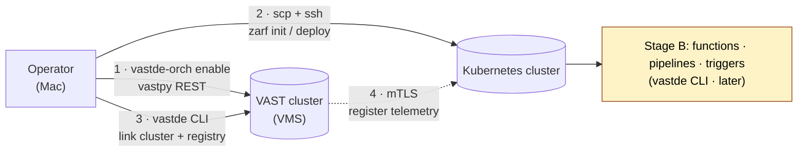
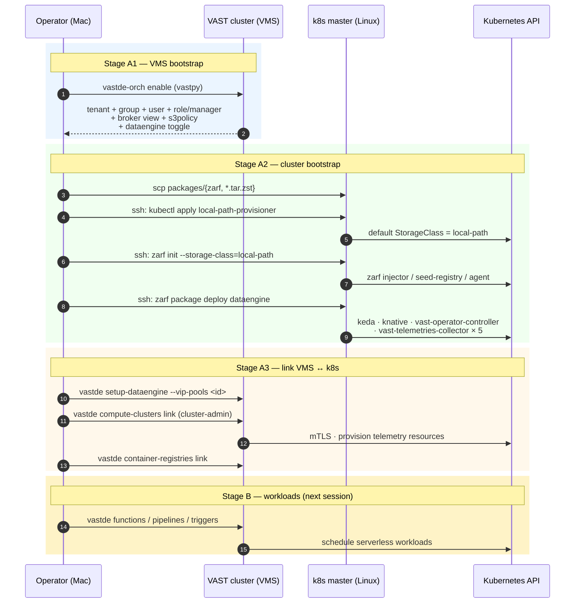
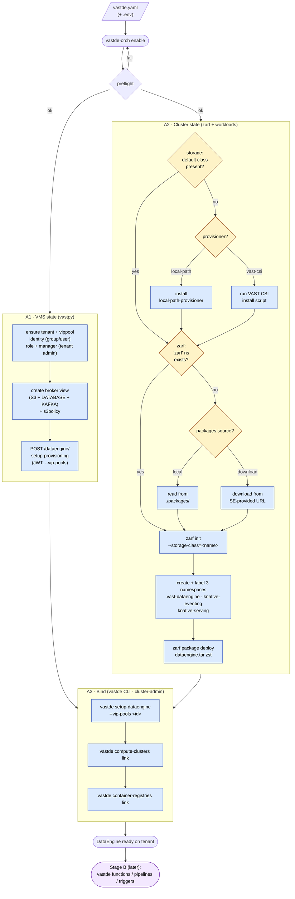
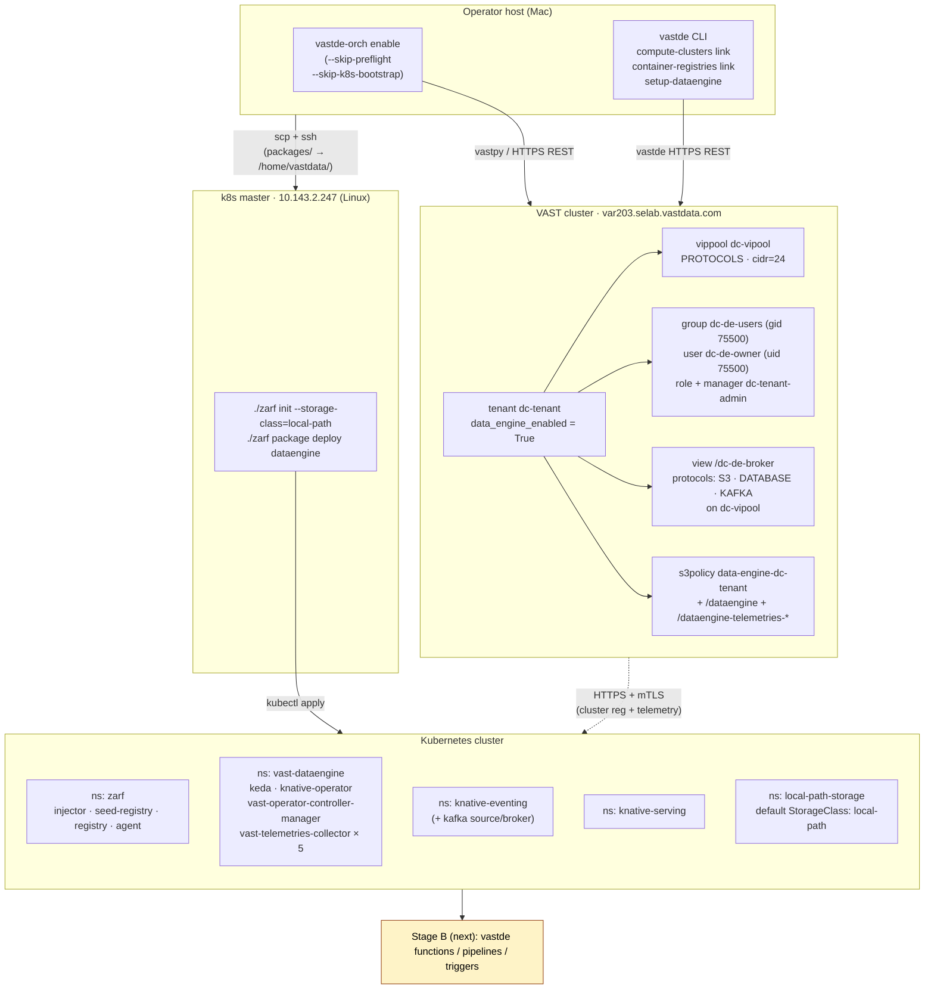

# Enabling DataEngine on dc-tenant — end-to-end

## High-level architecture

Three actors. The operator drives everything; VMS holds tenant/identity/broker state; the k8s cluster runs the workloads. After link, VMS pushes telemetry config to the cluster over mTLS. Stage B (pipelines) is the next layer.

## Workflow — order of operations

Three rectangles in the workflow map to A1 (VMS state), A2 (cluster runtime), A3 (binding the two). Stage B is everything you build on top.

## End-to-end deployment flow

> Target design including capability-based prereq handling (zarf detect/install, storage detect/install). See `KNOWN_ISSUES.md` TODO 1 — the capability blocks are not yet implemented in code, but the orchestrator already runs everything outside the yellow decision diamonds.

Reads top-down: YAML drives `enable`, preflight gates entry, then A1 (VMS) and A2 (cluster) proceed largely in parallel. A1 is straight-line vastpy calls; A2 is the capability-based detect-then-install design (yellow diamonds) for storage and zarf, both feeding into `zarf init → namespaces → package deploy`. A3 binds the two halves via cluster-admin `vastde` CLI calls, and the tenant is DataEngine-ready.

## Detailed architecture

## Integration plan
                                                                                                                                                              
  The pieces complement each other cleanly — vastde-orch handles everything VMS REST supports; vastde fills the two gaps:                                       
                                                                                                                                                                
  ┌─────────────────────────────────────────┬──────────────────────────────┐                                                                                    
  │ vastde-orch enable (vastpy / REST)      │ vastde CLI (DataEngine API)  │                                                                                    
  ├─────────────────────────────────────────┼──────────────────────────────┤                                                                                    
  │ tenant, vippool, identity (group/user), │ compute-clusters link        │                                                                                    
  │ tenant-admin manager+role+perms,        │ container-registries link    │                                                                                    
  │ broker view (S3/DATABASE/KAFKA),        │                              │                                                                                    
  │ view policy, s3policy,                  │ (functions, pipelines,       │                                                                                    
  │ /dataengine/setup-provisioning toggle   │  triggers — for Stage B)     │                                                                                    
  └─────────────────────────────────────────┴──────────────────────────────┘                                                                                    
                                                                                                                                                                
  Concrete steps                                                                                                                                                
                                                                                                                                                                
  1) Decode the .b64 certs to PEM for vastde                                                                                                                    
                                                                                                                                                                
  mkdir -p /Users/yemalin.godonou/Documents/vast/dataengine/sample/kube-creds/pem                                                                             
  cd /Users/yemalin.godonou/Documents/vast/dataengine/sample/kube-creds                                                                                         
  for f in ca client-cert key-client; do base64 -d -i ${f}.b64 -o pem/${f}.pem; done
                                                                                                                                                                
  2) Initialize vastde config (tenant-admin creds)                                                                                                              
                                                                                                                                                                
  set -a && source /Users/yemalin.godonou/Documents/vast/dataengine/.env && set +a                                                                              
  vastde config init \                                                                                                                                          
    --vms-url "https://${VMS_ADDRESS}" \                                                                                                                      
    --tenant "${TENANT_ADMIN_USER}" \                                                                                                                           
    --username "${TENANT_ADMIN_USER}" \                                                                                                                         
    --password "${TENANT_ADMIN_PASSWORD}" 
                                                                                                                                                                
  Stored at ~/.vast/config.toml with 0600 perms. TENANT_ADMIN_USER=dc-tenant happens to match the tenant name, so the same value satisfies both --tenant and    
  --username.                             
                                                                                                                                                                
  3) Run vastde-orch enable (VMS side — tenant, identity, broker, dataengine toggle)                                                                            
                                          
  cd /Users/yemalin.godonou/Documents/vast/dataengine                                                                                                           
  source .venv/bin/activate                                                                                                                                     
  vastde-orch enable -c sample/test-tenant.yaml --skip-preflight --skip-k8s-bootstrap --non-interactive
                                                                                                                                                                
  4) Link the K8s compute cluster                                                                                                                             
                                                                                                                                                                
  vastde compute-clusters link \
    --name dc-k8s-cluster \                                                                                                                                     
    --kube-api-url https://10.143.2.247:6443 \                                                                                                                
    --ca-path        sample/kube-creds/pem/ca.pem \                                                                                                             
    --client-cert-path sample/kube-creds/pem/client-cert.pem \                                                                                                
    --client-key-path  sample/kube-creds/pem/key-client.pem \
    --namespaces vast-dataengine                                                                                                                                
  
  5) Link the container registry                                                                                                                                
                                                                                                                                                              
  vastde container-registries link \                                                                                                                            
    --name dc-dockerhub \                                                                                                                                     
    --url docker.io \                     
    --primary-cluster dc-k8s-cluster \
    --primary-namespace vast-dataengine \                                                                                                                       
    --auth-type password \                    
    --username "${REGISTRY_USER}" \                                                                                                                             
    --password "${REGISTRY_PASSWORD}" 